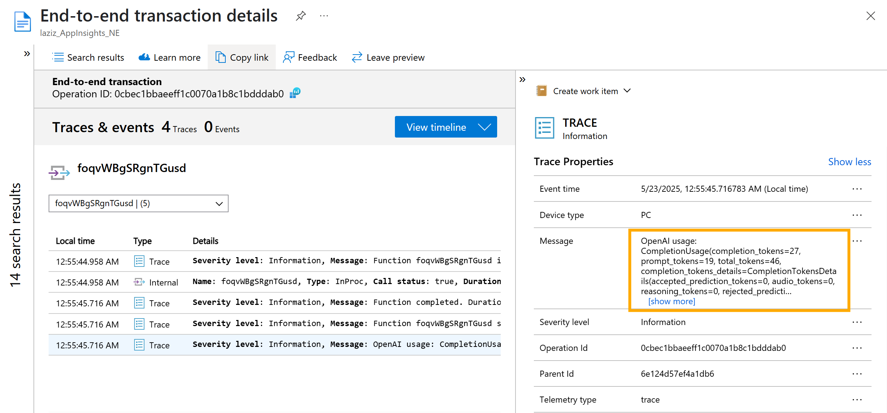

# Semantic Kernel: Jupyter Notebooks for Ramp-Up Learning Process

Semantic Kernel (SK) is an open-source SDK that enables orchestration of your AI workflows. SK facilitates the development of AI agentic solutions capable of reasoning, planning and integrating with various external data sources and execution services.

This repo contains Jupyter notebooks to assist you with the ramp-up learning process. These notebooks cover topics and Python code based on the official Semantic Kernel documentation site [here](https://learn.microsoft.com/en-us/semantic-kernel/overview/).

> [!WARNING]
> To run these notebooks successfully, you will need an Azure OpenAI Service deployment. Please ensure you have the following environment variables set up in your system:
>
> | Environment Variable          | Description                                                                                             |
> | :---------------------------- | :------------------------------------------------------------------------------------------------------ |
> | `AZURE_OPENAI_API_DEPLOY`     | The deployment name of your Azure OpenAI model, e.g. `gpt-41-mini`.                                     |
> | `AZURE_OPENAI_API_BASE`       | The endpoint URL of your Azure OpenAI service, e.g. `https://YOUR_AOAI_SERVICE_NAME.openai.azure.com/`. |
> | `AZURE_OPENAI_API_VERSION`    | The API version to use, e.g. `2025-03-01-preview`.                                                      |
> | `AZURE_APPINSIGHTS_CONNSTRING`| The Azure Application Insights' connection string                                                       |
>
> You can set these environment variables in your operating system or within a `.env` file in the root of your project and load them using a library like `python-dotenv`.


## 📑 Table of Contents
- [Notebook 1: Quick Start](#notebook-1-quick-start)
- [Notebook 2: Essentials - AI Services](#notebook-2-essentials---ai-services)
- [Notebook 3: Essentials - Filters](#notebook-3-essentials---filters)
- [Notebook 4: Essentials - Observability](#notebook-4-essentials---observability)

---
## Notebook 1: Quick Start
This notebook provides a fundamental intro to Semantic Kernel, guiding you through the initial setup.

You'll learn how to configure your environment, add an Azure OpenAI-based AI model, enable logging and integrate your first custom plugin. The notebook also demonstrates how to perform basic AI function calls and observe the interaction between the kernel and your plugin.

The code will demo fictitious home automation to switch on and off a table lamp, a porch light and a chandelier:


## Notebook 2: Essentials - AI Services
This notebook intrduces management of **AI services** within Semantic Kernel.

You'll learn how to add AI services to the kernel, retrieve them using different methods (by type or service ID) and directly utilise chat completion services for both non-streaming and streaming responses. This notebook is essential for understanding how to connect SK to your chosen AI models.

It also shows how to build **Rich Chat History** by combining text with images and adding personalised user data through simulated function calls. With an example, where user is asking:
``` JSON
I'm looking to book a room. Can you help me find something similar to what's in this picture?
```
and uploading this image:
*(Image courtesy of Pexels)*

The AI assistant can then use this visual information and user preferences (like loyalty status) to provide a tailored response:
``` JSON
Assistant: The room in the picture features a king-sized bed with a stylish headboard, neutral and warm decor tones with an orange accent pillow, modern wall lamps, and framed art. It also shows a clean, contemporary bathroom adjacent to the bedroom.

Since you have Diamond loyalty status and prefer amenities like a king bed, balcony, high floor, and late checkout, I will look for a premium room that closely matches this style and your preferences. Could you please let me know the location or city where you want to book this room, and your check-in and check-out dates?`
```

## Notebook 3: Essentials - Filters
This notebook provides an introduction to using **Filters** in Semantic Kernel.

Filters allow you to inject custom logic at specific points in the kernel's execution pipeline, enabling powerful control over AI interactions, e.g., on the prompts being entered or AI content generated.

For demonstration purposes, "badword" is set as a forbidden word in the *Function Invocation* filter. Depending on the user's input, they may get a response like this:
``` JSON
------------------------
- User Input: I like to talk about good things, not badword.
- Filter Action: Detected forbidden word 'badword'. Blocking function invocation.
- Assistant Response (from Filter): I cannot process requests containing prohibited words. Please try again.
------------------------
- User Input: What is the capital of France?
- Filter Action: No forbidden word found. Proceeding with function invocation.
- Assistant Response (from LLM): The capital of France is Paris.
------------------------
```

## Notebook 4: Essentials - Observability

This notebook introduces **Observability** in Semantic Kernel, demonstrating how to collect and visualise telemetry of your AI solution.

The code in this notebook will show how to log traces and metrics generated by Semantic Kernel's interactions with Azure Application Insights. You will then be able to visualise this telemetry data in Azure AI Foundry, providing insights into the performance and behavior of your AI agents.

